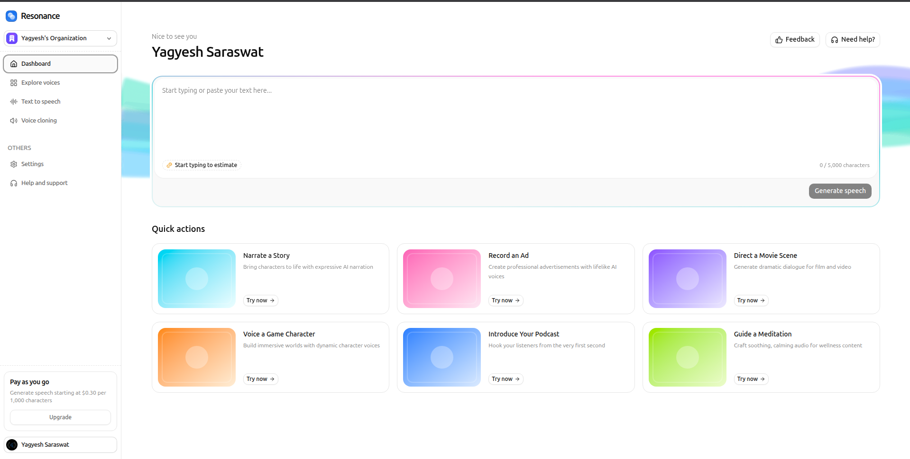
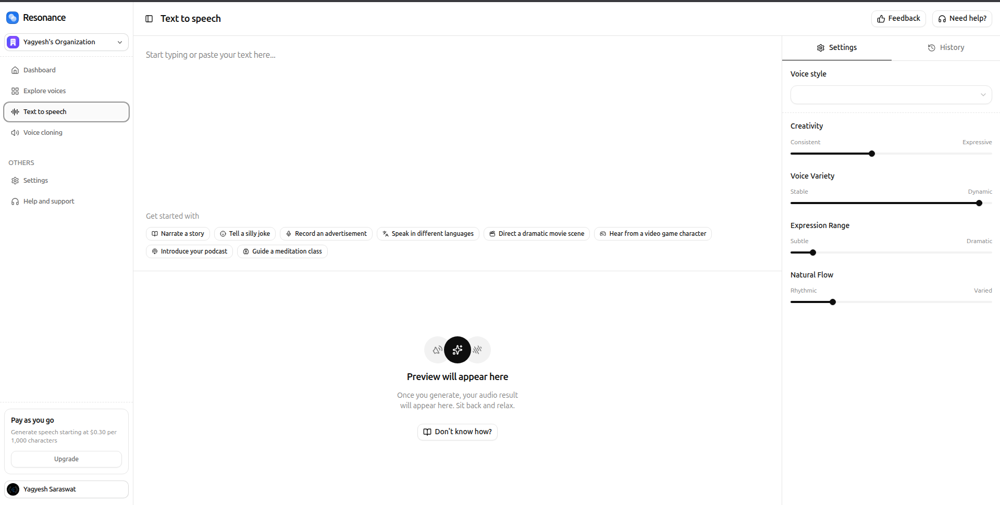
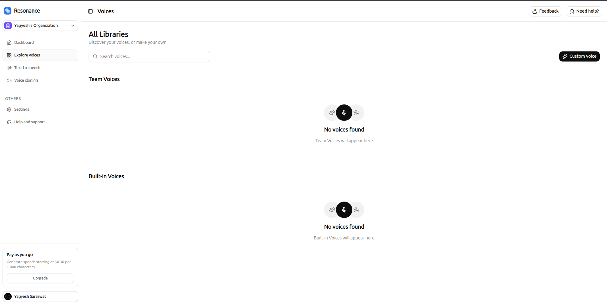
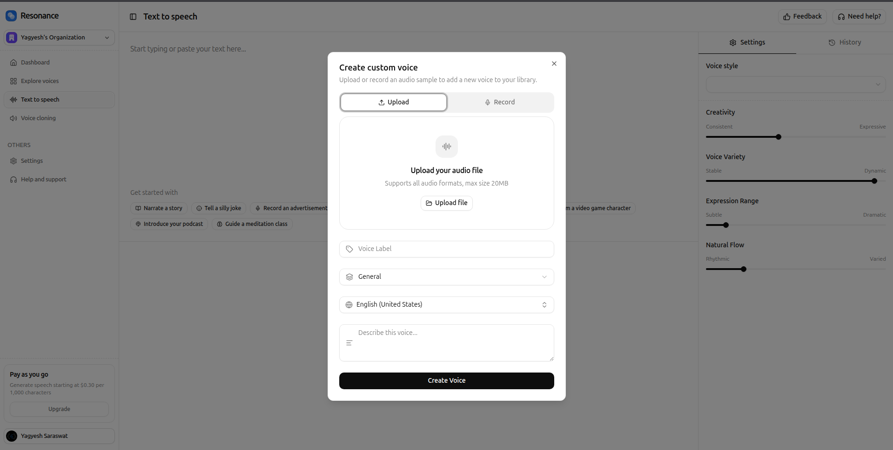
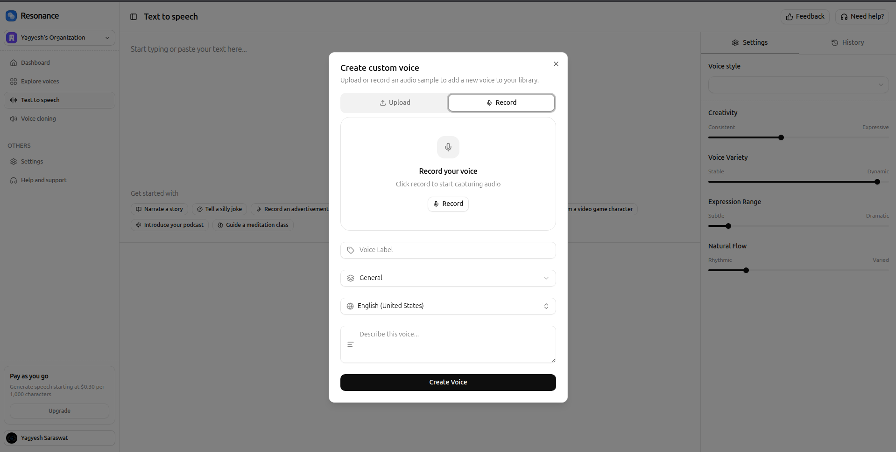
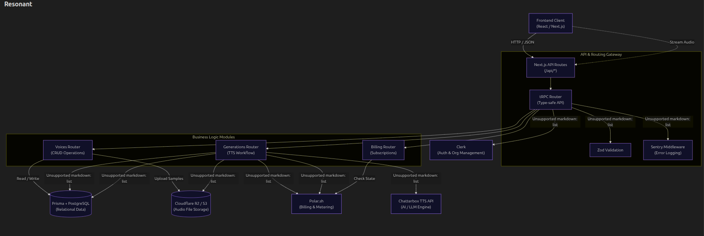
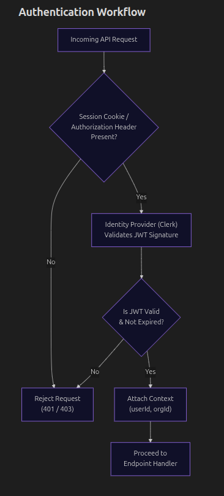
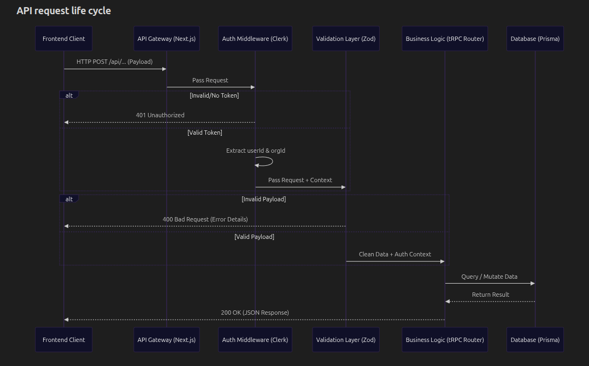
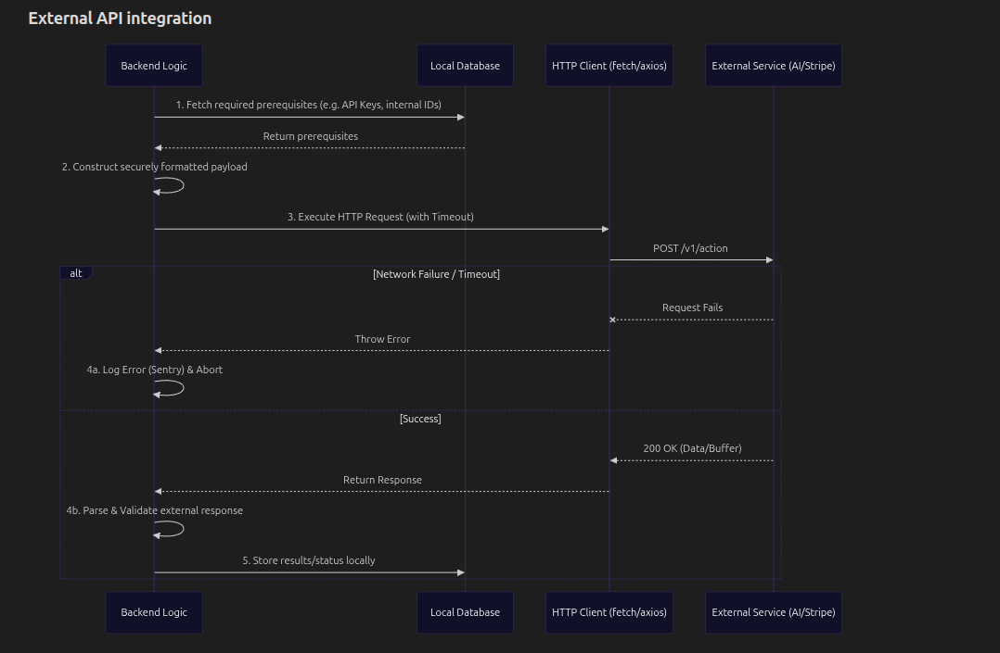

# Resonant

Resonant is an advanced Text-to-Speech (TTS) application with custom voice cloning capabilities, powered by a Next.js full-stack framework integrated with external cloud services and AI inference layers.

## 🖥️ Frontend Pages

The frontend provides an intuitive and seamless experience for users to manage voices, generate speech, and explore text-to-speech possibilities.

### 1. Dashboard
The central hub for your account. It gives you an overview of your recent TTS generations, voice library, and subscription status.

### 2. Text to Speech
The main workspace where you can input text, adjust generation parameters (temperature, top-p, etc.), and generate high-quality audio using either system voices or your own cloned custom voices.

### 3. Explore Voices
A library of available system voices categorized by use-case (Narrative, Audiobook, Conversational, etc.) alongside your custom generated voices. You can listen to samples and pick the perfect voice for your project.

### 4. Voice Cloning
Upload audio files to clone new voices. You can manage your cloned voices, assign them metadata (categories, descriptions, languages), and have them instantly available for TTS generations.

You can also record audio directly from your browser to create a voice clone instantly!

## ⚙️ Backend High-Level Design (HLD)

The backend system relies on Next.js App Router and tRPC for orchestration, PostgreSQL (via Prisma) for relational data, Cloudflare R2 for highly scalable audio blob storage, and Modal for serverless GPU inference of the TTS engine.

