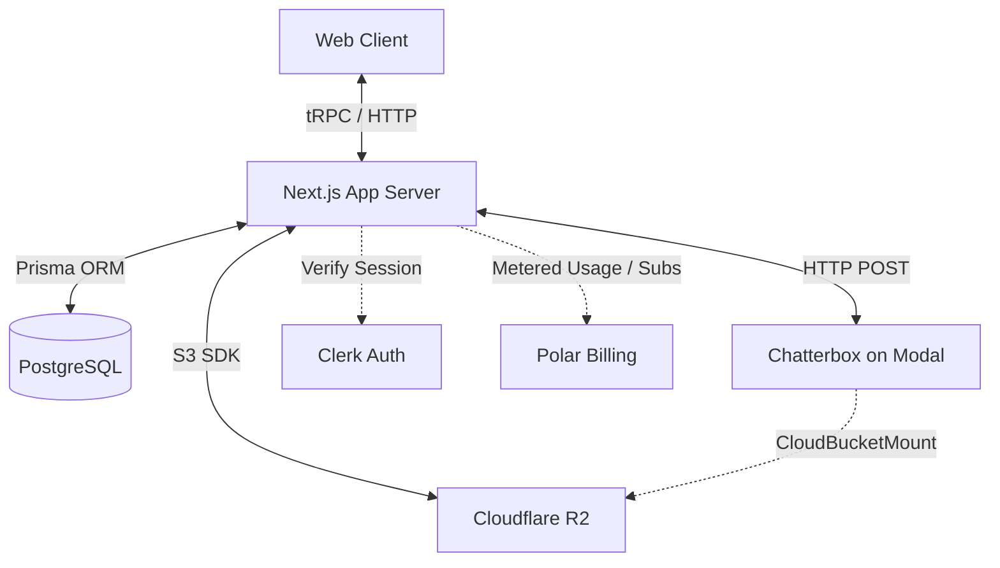

# Resonant Backend High Level Design (HLD)

This document provides a high-level architectural overview of the Resonant project's backend system. Resonant is a Text-to-Speech (TTS) application with custom voice cloning capabilities, featuring a Next.js full-stack framework integrated with external cloud services and AI inference layers.

## 1. System Architecture Overview

The backend architecture consists of several distributed components:

1. **Next.js App Server**: The central orchestrator handling API routes, tRPC endpoints, database connections, and business logic.
2. **PostgreSQL Database**: The primary datastore for metadata (voices, generations, user-data).
3. **Cloudflare R2**: Object storage for audio files (cloned voices and generated TTS outputs).
4. **Chatterbox TTS Engine**: A decoupled Python-based inference engine deployed on Modal, providing the actual machine learning text-to-speech functionality.
5. **Clerk Auth**: Managed identity and authentication service.
6. **Polar**: Billing and subscription management, including metered billing for API usage.

## 2. Core Components

### 2.1 Next.js App Server (API & tRPC Layer)
The core backend logic is implemented within the Next.js `App Router` (`src/app/api`) and a **tRPC** layer (`src/trpc`). 
- **tRPC Routers**: Strongly-typed endpoints handle interactions like fetching voices (`voicesRouter`), initiating generations (`generationsRouter`), and billing workflows (`billingRouter`).
- **REST API Routes**: Standard API routes handle binary uploads (e.g., `POST /api/voices/create` for voice cloning) and secure audio streaming (e.g., `GET /api/audio/[generationId]`).
- **Authentication Context**: Every request is authenticated using Clerk, ensuring operations are scoped down to the `orgId` and `userId`.

### 2.2 Database (PostgreSQL & Prisma)
PostgreSQL is accessed via **Prisma ORM**. The schema is minimal, focusing on tracking metadata while heavy binary data lives in R2.
- **`Voice` Model**: Stores metadata for voices, categorized as either `SYSTEM` (global) or `CUSTOM` (tenant-specific). Holds references to the R2 object keys where the cloned voice audio is stored.
- **`Generation` Model**: Tracks historical TTS generations mapped to organizations and voices. Stores ML generation parameters (temperature, topP, topK) and the R2 object key of the generated audio.

### 2.3 Object Storage (Cloudflare R2)
Cloudflare R2, using the AWS S3 SDK, provides cost-effective object storage:
- **Voice Clones**: Uploaded audio clips for voice cloning are stored under `voices/orgs/{orgId}/{voiceId}`.
- **Generated Audio**: Final TTS output WAV files are stored under `generations/orgs/{orgId}/{generationId}`.
- Next.js issues **signed URLs** allowing the client to securely fetch audio without proxying large files through the Node.js server.

### 2.4 ML Inference (Chatterbox on Modal)
The actual TTS engine (`chatterbox_tts.py`) is decoupled from the Node.js server and runs on **Modal** (serverless GPU provider).
- **Inference Server**: Exposes a FastAPI endpoint (`/generate`) running on A10G GPUs.
- **Direct Storage Access**: Uses Modal's `CloudBucketMount` to directly read voice clone files from R2, minimizing data transfer latency over the network.
- **Inference Engine**: Uses the `ChatterboxTurboTTS` model to generate WAV audio bytes from text and a voice prompt.

### 2.5 Billing and Metering (Polar)
The system integrates with Polar for subscription gating and usage-based billing:
- **Subscription Checks**: Before generating audio or cloning voices, the backend queries Polar to ensure the organization has an active subscription.
- **Metering**: Uses Polar's event ingestion API to asynchronously report metered usage (e.g., `POLAR_METER_TTS_GENERATION` based on text length, and `POLAR_METER_VOICE_CREATION`).

## 3. Core Workflows

### 3.1 Voice Creation (Cloning) Workflow
1. Client uploads an audio file via `POST /api/voices/create`.
2. Backend verifies subscription via Polar and validates the audio file using `music-metadata`.
3. Backend creates a `Voice` record in PostgreSQL.
4. Audio bytes are uploaded to Cloudflare R2.
5. Backend updates the `Voice` record with the R2 object key.
6. A metering event is emitted to Polar.

### 3.2 Text-to-Speech Generation Workflow
1. Client calls the `generations.create` tRPC mutation.
2. Backend verifies subscription status.
3. Backend fetches the selected `Voice` from the DB to get its R2 object key.
4. Backend issues an HTTP POST to the Modal Chattebox endpoint with generation parameters.
5. Modal GPU instance performs inference (directly mounting the Voice from R2) and streams the generated WAV buffer back to Next.js.
6. Next.js creates a `Generation` record in the DB and uploads the resulting WAV buffer to R2.
7. Next.js returns the `generationId` and emits a TTS metering event to Polar.
8. Client uses `GET /api/audio/[generationId]` to obtain a signed R2 URL and play the audio.

## 4. Scalability and Reliability
- **Decoupled Heavy Compute**: The high-latency, memory-intensive ML operations are isolated in a separate, auto-scaling Modal environment rather than blocking Node.js event loops.
- **Pre-signed URLs**: Offloading audio streaming to R2 directly reduces the bandwidth and load on the Next.js server.
- **Fire-and-forget Metering**: Interactions with Polar for event ingestion are handled asynchronously (`.catch(() => {})`) to ensure billing subsystem outages do not break the core user experience.
